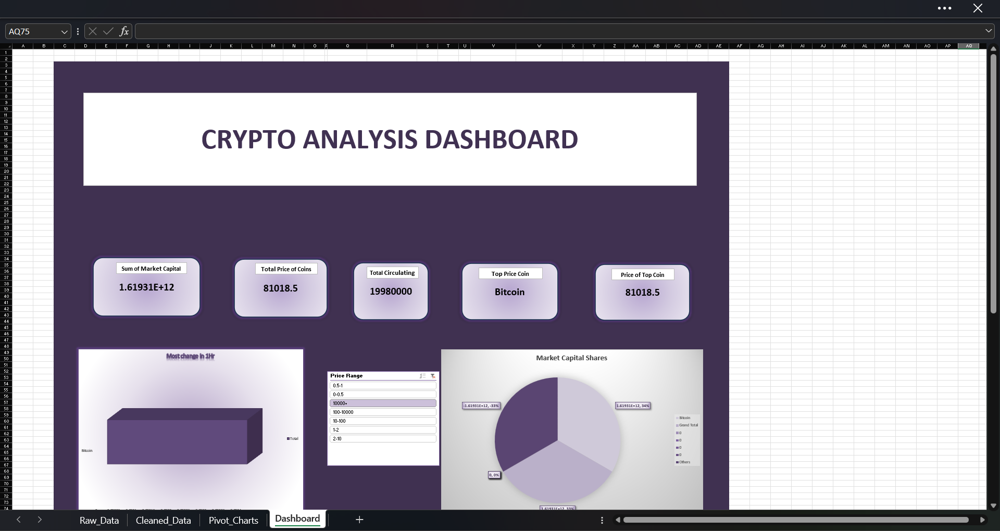
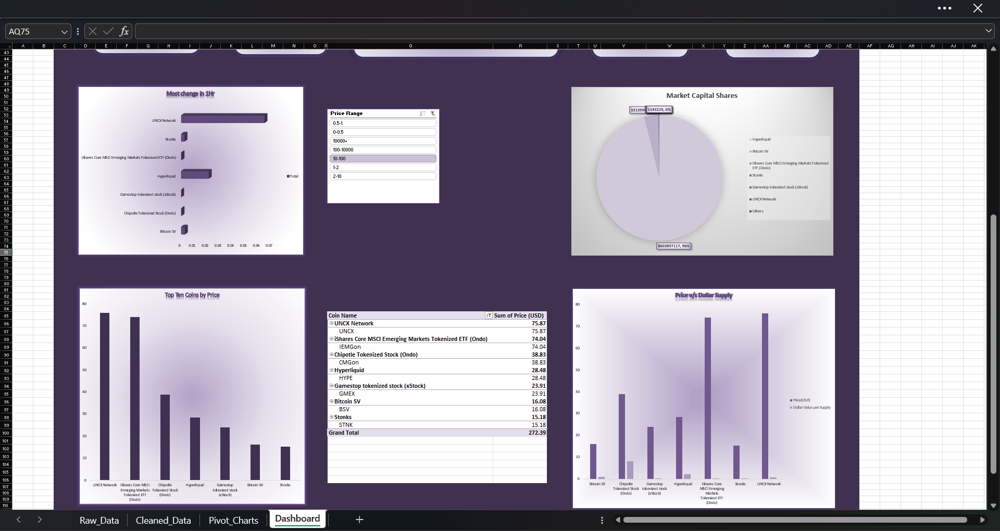
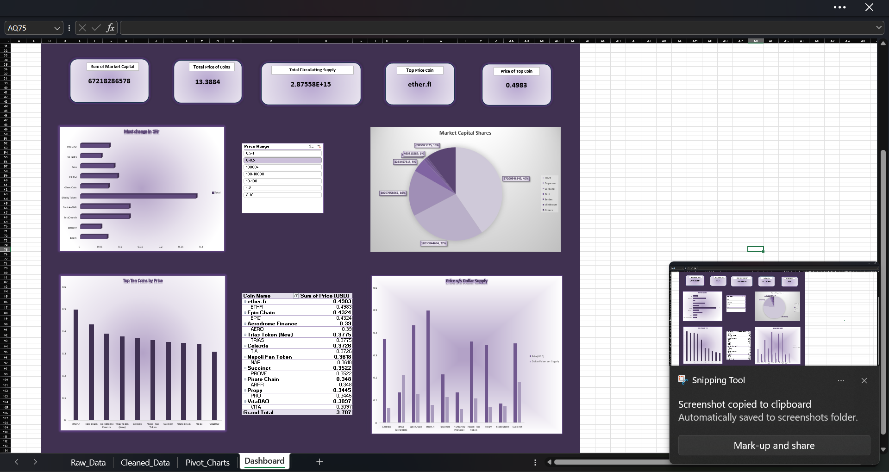
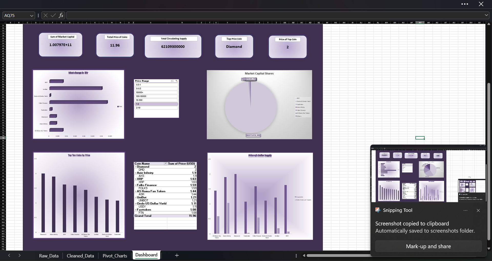

💹 Crypto Analysis Dashboard

Crypto Analysis Dashboard is a comprehensive data visualization and market tracking tool developed during my 4-month Data Analysis internship at NullClass. This project demonstrates the application of advanced Excel techniques to translate complex cryptocurrency market data into actionable visual insights.
📊 Project Overview

The primary goal of this project was to analyze cryptocurrency market trends and price volatility to assist in informed decision-making. It serves as a practical application of the data analysis skills I am honing as a Computer Science and Engineering student at Jawaharlal College of Engineering and Technology.
✨ Key Features

    Real-time Trend Tracking: Monitors price movements and market volume across major cryptocurrencies.

    Volatility Analysis: Evaluates market risk through percentage change and historical price fluctuations.

    Interactive Visualizations: Dynamic charts and graphs for clear, at-a-glance market summaries.

    Data Cleaning & Processing: Robust handling of raw crypto datasets to ensure accuracy in reporting.

🛠️ Technical Skills Demonstrated

    Advanced Excel: Pivot Tables, VLOOKUP/XLOOKUP, Power Query, and Conditional Formatting.

    Data Analytics: Exploratory Data Analysis (EDA) and KPI tracking.

    Market Research: Understanding financial metrics and crypto-market behaviors.

📸 Dashboard Preview

Here is a glimpse of the final dashboard interface:

📁 Repository Structure

    Crypto_Analysis_Dashboard.xlsx: The main interactive Excel file.

    /screenshot: Contains visual previews of the dashboard.

    /Data: Raw datasets used for the analysis.
